<p align="center">
  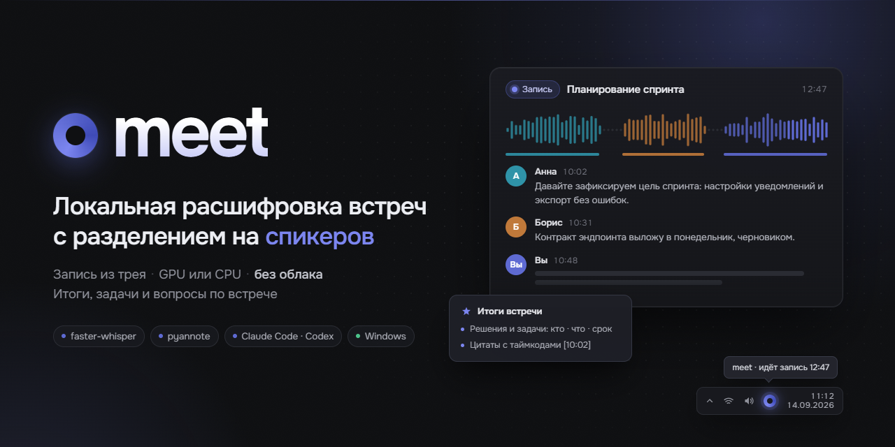
</p>

<p align="center">
  <b>Записывает рабочие встречи и расшифровывает их на вашем компьютере — с именами спикеров, итогами и ответами на вопросы.</b>
</p>

<p align="center">
  <a href="LICENSE"></a>
  <a href="https://github.com/rnv812/meet-transcriber/releases"></a>
  
  <a href="https://tauri.app"></a>
</p>

<p align="center">
  <a href="#что-это">Что это</a> ·
  <a href="#возможности">Возможности</a> ·
  <a href="#установка">Установка</a> ·
  <a href="#как-пользоваться">Как пользоваться</a> ·
  <a href="#без-приложения-cli">CLI</a> ·
  <a href="#приватность">Приватность</a> ·
  <a href="#разработка">Разработка</a> ·
  <a href="#english-summary">English</a>
</p>

## Что это

meet — приложение для Windows, которое записывает созвоны и расшифровывает их
локально: распознаёт речь, разделяет её по спикерам и узнаёт знакомые голоса.
Оно живёт в трее, само начинает запись, когда начинается звонок, и работает на
видеокарте NVIDIA или на процессоре. Итоги, ответы на вопросы и агент по
встрече работают через вашу подписку Claude Code или Codex; пока вы не
обращаетесь к модели, записи и расшифровки не покидают компьютер.

## Возможности

**Запись**
- Две дорожки: ваш микрофон и звук собеседников (WASAPI loopback) — без
  виртуальных кабелей и ботов в звонке.
- Автозапись звонков в Zoom, Teams, Телемосте, Dion, Webex, мессенджерах и в
  браузере; обрыв связи и перезаход не делят встречу на части.
- Запуск из трея или окна; импорт готовых аудио- и видеофайлов перетаскиванием.

**Расшифровка**
- faster-whisper: Whisper large-v3, дообученная на русском (на процессоре —
  Whisper medium), выравнивание по словам и разделение на спикеров (pyannote).
- База голосов: назовите человека один раз — дальше он узнаётся сам.
- Словарь терминов подсказывает распознаванию имена, продукты и жаргон.

**Встречи**
- Библиотека записей с плеером: щелчок по реплике — переход к этому месту.
- Поиск по названиям и тексту всех встреч, подсветка совпадений в расшифровке.
- Объединение записей одной встречи, правка имён, экспорт в Markdown, TXT и SRT.

**Ассистент**
- Итоги: решения, задачи «кто · что · срок», открытые вопросы, цитаты с таймкодами.
- Вопросы по встрече — ответы со ссылками на время в записи.
- Вкладка «Агент» — Claude Code или Codex в терминале прямо в папке встречи.
- Живой режим: дайджест и вопросы по ходу встречи в плавающей панели.

**Интеграции**
- Выгрузка в базу знаний (например, Obsidian): папка на встречу по шаблону,
  расшифровка, итоги, по желанию субтитры и аудио.
- Командная строка `meet` и локальный API — для скриптов и агентов.

<table>
  <tr>
    <td width="50%">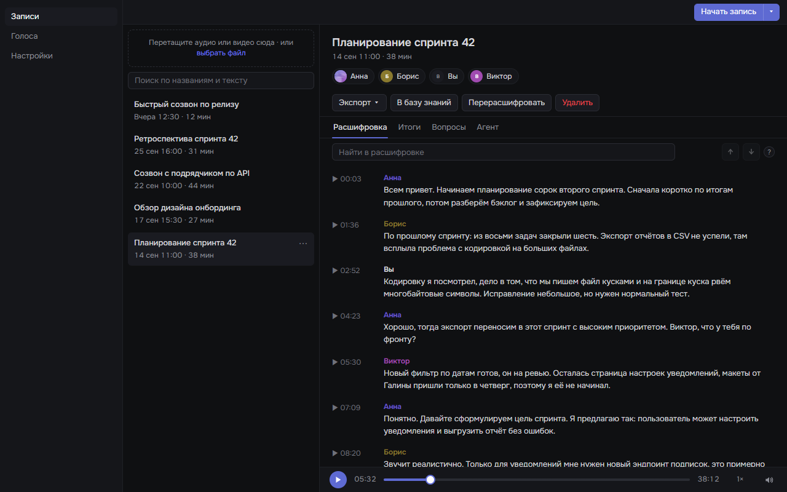</td>
    <td width="50%">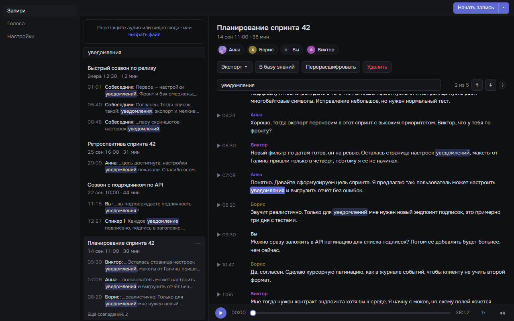</td>
  </tr>
  <tr>
    <td align="center">Библиотека, расшифровка и плеер</td>
    <td align="center">Поиск по всем встречам</td>
  </tr>
  <tr>
    <td>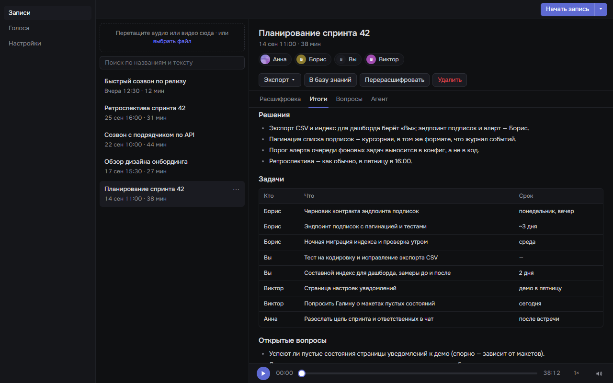</td>
    <td>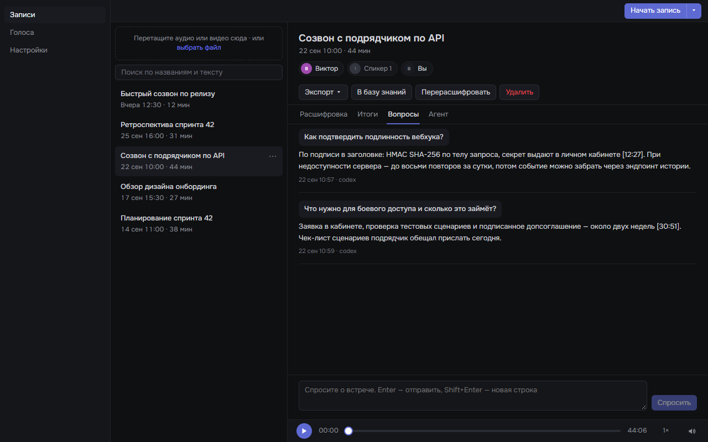</td>
  </tr>
  <tr>
    <td align="center">Итоги: решения и задачи</td>
    <td align="center">Вопросы по встрече</td>
  </tr>
  <tr>
    <td>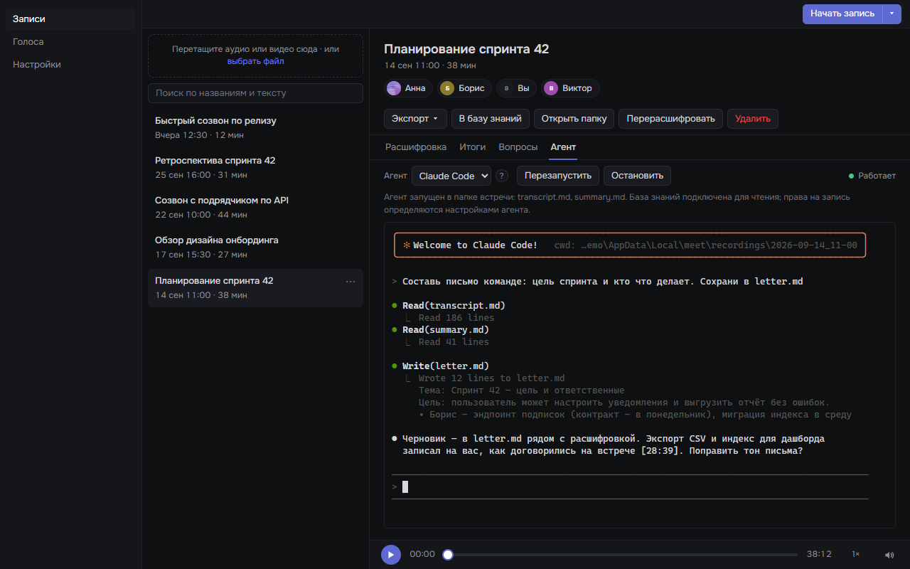</td>
    <td>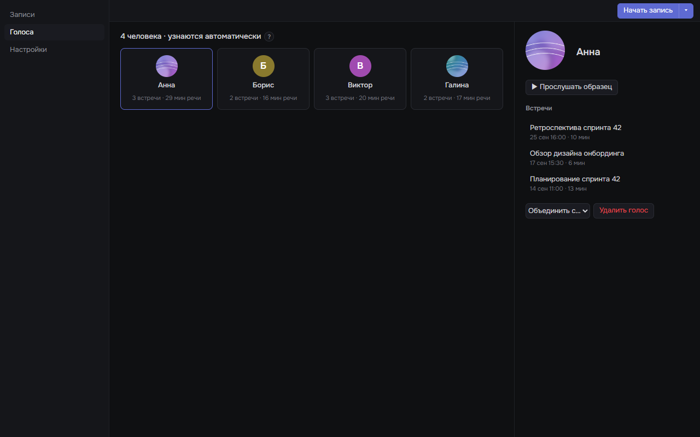</td>
  </tr>
  <tr>
    <td align="center">Агент в папке встречи</td>
    <td align="center">База голосов</td>
  </tr>
  <tr>
    <td>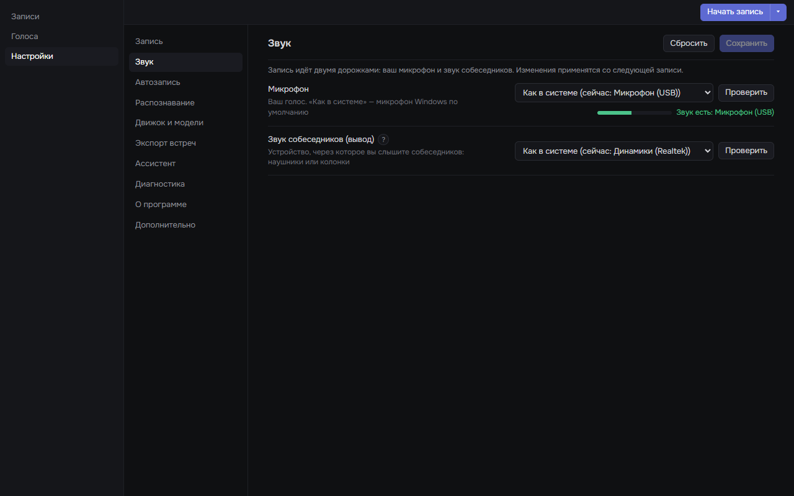</td>
    <td>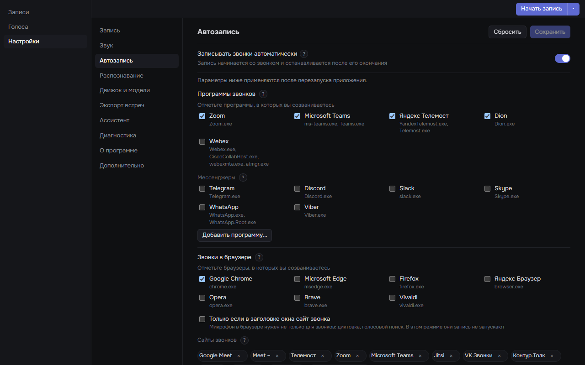</td>
  </tr>
  <tr>
    <td align="center">Звук: микрофон и вывод</td>
    <td align="center">Автозапись: программы и браузеры</td>
  </tr>
</table>

<sub>На скриншотах — выдуманные встречи и люди.</sub>

## Установка

Нужна Windows 10 или 11 (x64). Права администратора не требуются.

1. Скачайте `meet_<версия>_x64-setup.exe` со страницы
   [Releases](https://github.com/rnv812/meet-transcriber/releases). Рядом
   лежит `SHA256SUMS.txt`; сверить файл можно командой
   `certutil -hashfile meet_<версия>_x64-setup.exe SHA256`.
2. Установщик не подписан, поэтому SmartScreen его остановит: «Система Windows
   защитила ваш компьютер» → **Подробнее** → **Выполнить в любом случае**.
3. Программа ставится в `%LOCALAPPDATA%\meet`, ярлык «meet» появляется в меню
   «Пуск» и на рабочем столе.

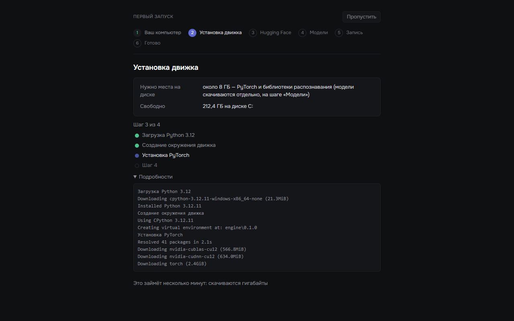

**Мастер первого запуска** проведёт через несколько шагов:

- определит видеокарту и выберет движок: для NVIDIA (CUDA) — около 4,5 ГБ
  загрузки и 8 ГБ на диске, для процессора — около 0,6 ГБ и 3 ГБ;
- поставит движок расшифровки (Python, PyTorch, библиотеки распознавания) —
  ход виден по шагам;
- поможет подключить токен Hugging Face (шаг можно пропустить);
- скачает модели — ещё до 4,5 ГБ;
- проверит микрофон и звук собеседников;
- предложит запускаться вместе с Windows.

Дальше приложение живёт в трее. Мастер можно запустить снова: «Настройки →
Движок и модели».

<br clear="right">

### Токен Hugging Face

Токен нужен только для разделения на спикеров: модель
[pyannote/speaker-diarization-community-1](https://huggingface.co/pyannote/speaker-diarization-community-1)
скачивается после принятия её условий. Без токена расшифровка работает, но
реплики делятся только на «Вы» и «Собеседник».

1. Войдите на [huggingface.co](https://huggingface.co) (регистрация бесплатная).
2. Откройте [страницу модели](https://huggingface.co/pyannote/speaker-diarization-community-1)
   и примите условия использования.
3. Создайте токен с правом чтения (Read) в
   [настройках токенов](https://huggingface.co/settings/tokens).
4. Вставьте его в мастер или в «Настройки → Движок и модели». Приложение
   проверит доступ и сохранит токен в диспетчере учётных данных Windows.

### Обновление

- Скачайте новый установщик и запустите его поверх — записи, голоса и
  настройки сохранятся.
- Или нажмите «Настройки → О программе → **Проверить обновления**»: приложение
  сверит версию с последним выпуском, скачает установщик, проверит его SHA-256 и
  запустит. Во время записи обновиться нельзя — сначала остановите её.

После обновления движок новой версии ставится в фоне тем же профилем (CUDA или
CPU); пакеты почти все берутся из кэша, обычно это минута-две.

### Удаление

«Параметры → Приложения → meet → Удалить» убирает программу, ярлыки и
автозапуск. Данные остаются в `%LOCALAPPDATA%\meet` — записи, база голосов,
настройки, журналы и движок, — и повторная установка подхватит их. Чтобы убрать
всё, удалите эту папку, при желании — кэши `%USERPROFILE%\.cache\huggingface` и
`%LOCALAPPDATA%\uv\cache` (они общие с другими программами) и запись `meet` в
диспетчере учётных данных Windows.

## Как пользоваться

### Трей и запись

Значок в трее показывает состояние: ожидание звонка, запись (в подсказке —
сколько она идёт), расшифровка. **Левый щелчок** открывает окно, **правый** —
меню: «Начать запись», «Начать запись с ассистентом», «Импортировать файл…»,
переключатель «Автозапись», «Выход».

Запись идёт двумя дорожками и после остановки сразу расшифровывается
(отключается в «Настройки → Запись»). Микрофон и устройство вывода по умолчанию
берутся из Windows, выбрать другие можно в «Настройки → Звук».

### Автозапись

«Настройки → Автозапись» — отметьте программы, в которых созваниваетесь:

- **Приложения** (Zoom, Microsoft Teams, Яндекс Телемост, Dion, Webex,
  Telegram, Discord и другие): запись начинается, когда программа заняла
  микрофон или воспроизводит звук.
- **Браузеры** (Chrome, Edge, Firefox, Яндекс Браузер и другие): звонком
  считается микрофон, занятый дольше 15 секунд, — видео и голосовой поиск
  запись не запускают. Можно дополнительно требовать сайт звонка в заголовке
  окна (Google Meet, Телемост, Jitsi…).

После звонка запись ждёт возвращения 10 минут (от 1 до 60): обрыв связи и
перезаход не делят встречу на две. Минуты ожидания потом обрезаются — в записи
остаётся 30 секунд после конца звонка.

### Живой ассистент

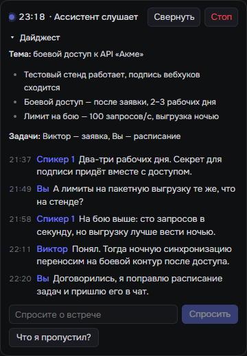

«Начать запись ▾ → **С ассистентом**» в окне или «Начать запись с
ассистентом» в трее. Поверх всех окон появится панель: таймер, последняя
реплика, а в развёрнутом виде — дайджест встречи, лента реплик с именами и поле
для вопроса («Что я пропустил?»). Панель не забирает фокус у звонка. После
остановки запись расшифровывается целиком, как обычная.

<br clear="right">

### Итоги и вопросы

Вкладка «**Итоги**» → «Сделать итоги»: модель пишет резюме, решения, таблицу
задач «Кто · Что · Срок», открытые вопросы и цитаты с таймкодами. Вкладка
«**Вопросы**» — свободные вопросы по встрече; ответы ссылаются на время в
записи.

Модель выбирается в «Настройки → Ассистент»: установленный и авторизованный
[Claude Code](https://claude.ai/code) или [Codex](https://github.com/openai/codex)
(работают по вашей подписке) либо локальный OpenAI-совместимый сервер. Там же
задаются прокси и папка базы знаний, которую ассистент может читать.

### Агент

Вкладка «**Агент**» запускает Claude Code или Codex во встроенном терминале в
папке встречи: перед запуском приложение обновляет `transcript.md` (расшифровка
с именами и таймкодами), рядом лежит `summary.md`. Агента можно попросить
написать письмо по итогам, сверить договорённости с базой знаний или разобрать
спорный момент. Что агенту разрешено, определяют его собственные настройки.

### Спикеры и голоса

Щелчок по имени спикера в карточке — «Кто это?»: введите имя и отметьте
«Запомнить голос — узнавать дальше». Имя заменится во всей расшифровке, а голос
попадёт в базу — в следующих встречах человек подпишется сам. Раздел «**Голоса**»
показывает базу: сколько встреч и минут речи у каждого, фото или инициалы,
переименование, слияние и удаление.

### Поиск

Строка над списком ищет по названиям и тексту всех встреч и показывает
фрагменты с таймкодами. Щелчок по фрагменту открывает встречу на этом месте, а
поиск по расшифровке (Ctrl+F) подсвечивает все совпадения: «2 из 5», стрелки —
к следующему и предыдущему.

### Объединение

Встреча разбилась на несколько записей — отметьте их в списке Ctrl- или
Shift-щелчком и нажмите «**Объединить**». Записи склеиваются по времени и
расшифровываются заново целиком: спикеры общие, на стыках — «— перерыв N мин —».
Исходные записи удаляются, если не отмечено «Сохранить исходные записи».

### Экспорт в базу знаний

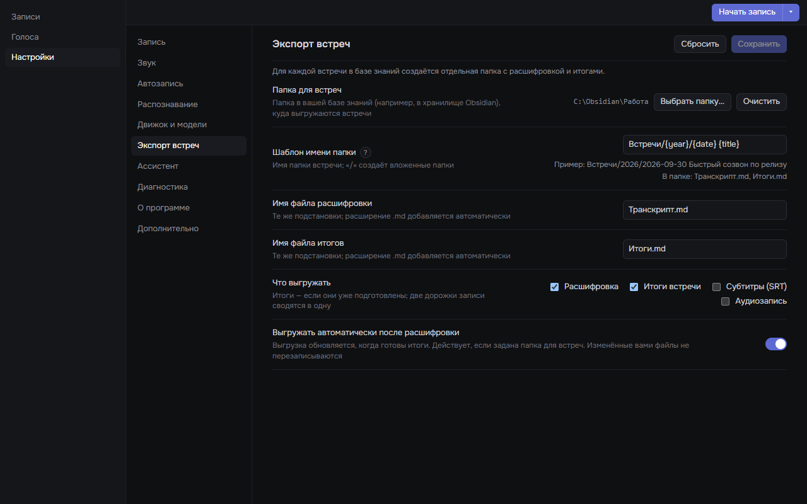

«Настройки → Экспорт встреч»: папка для встреч (например, внутри хранилища
Obsidian), шаблон имени папки и что класть внутрь. Подстановки: `{date}`,
`{time}`, `{year}`, `{month}`, `{day}`, `{title}`; «/» создаёт вложенные папки.
С шаблоном `Встречи/{year}/{date} {title}` получится:

```text
C:\Obsidian\Работа\
└── Встречи\
    └── 2026\
        └── 2026-09-14 Планирование спринта 42\
            ├── Транскрипт.md
            └── Итоги.md
```

Выгрузка идёт кнопкой «В базу знаний» в карточке или сама — после расшифровки
и ещё раз, когда готовы итоги. Файлы, которые вы поправили в базе знаний, не
перезаписываются. Разово сохранить расшифровку файлом — «Экспорт ▾» (Markdown,
TXT, SRT).

## Без приложения (CLI)

Основное доступно из командной строки — без окна и без вопросов. У
установленного приложения команда лежит в
`%LOCALAPPDATA%\meet\engine\<версия>\Scripts\meet.exe`, при запуске из
исходников — `.venv\Scripts\meet`. Запись указывается папкой или id (имя папки
в библиотеке, например `2026-09-14_11-00`); `--json` печатает машиночитаемый
ответ. Код выхода: 0 — готово, 1 — ошибка, 2 — неверные аргументы.

| Команда | Что делает | Пример |
| --- | --- | --- |
| `record` | записать встречу (Ctrl+C — стоп) | `meet record` |
| `transcribe` | расшифровать папку записи или любой аудио/видеофайл | `meet transcribe звонок.mp4 --speakers 3` |
| `import` | добавить файл в библиотеку и расшифровать | `meet import звонок.mp4` |
| `export` | расшифровка в md, txt или srt | `meet export 2026-09-14_11-00 --format srt --out встреча.srt` |
| `voices` | база голосов: `list`, `rename`, `merge`, `delete`, `avatar` | `meet voices rename "Демьян" "Демьян Петров"` |
| `summary` | итоги встречи → `summary.md` | `meet summary 2026-09-14_11-00 --provider codex` |
| `ask` | вопрос по встрече, ответ → `qa.jsonl` | `meet ask 2026-09-14_11-00 "Кто взял экспорт?"` |
| `kb-export` | выгрузить встречу в базу знаний | `meet kb-export 2026-09-14_11-00` |
| `notes` | то же, что `kb-export` (прежнее имя) | `meet notes 2026-09-14_11-00` |
| `merge` | объединить записи одной встречи и расшифровать | `meet merge 2026-09-14_11-00 2026-09-14_11-40 --keep` |
| `live-stop` | штатно остановить запись с ассистентом | `meet live-stop` |
| `status` | что делает служба записи: запись, автозапись, детектор звонка | `meet status` |

Полный список флагов — `meet <команда> --help`.

## Приватность

- **Всегда локально:** запись, расшифровка, разделение на спикеров, база
  голосов, поиск, экспорт. Данные лежат в `%LOCALAPPDATA%\meet` (папку записей
  можно перенести). Служба записи принимает запросы только с этого компьютера:
  API слушает `127.0.0.1` и требует токен.
- **Модель — только по вашей просьбе.** Текст встречи уходит выбранному
  провайдеру (Claude Code — в Anthropic, Codex — в OpenAI), когда вы делаете
  итоги, задаёте вопрос или ведёте запись с ассистентом. Агент во вкладке
  «Агент» работает с файлами папки встречи по своим правилам. С локальным
  OpenAI-совместимым сервером текст не покидает компьютер.
- **Hugging Face** — загрузка моделей и проверка токена. Токен хранится в
  диспетчере учётных данных Windows.
- **Установка движка** скачивает Python (через uv) и пакеты с PyPI и
  download.pytorch.org.
- **GitHub** — только когда вы нажимаете «Проверить обновления». Сама программа
  за обновлениями в сеть не ходит и телеметрию не собирает.

## Платформы

Сейчас — Windows 10 и 11 (x64). Linux и macOS в планах; сборка для macOS
поначалу выйдет непроверенной.

## Разработка

```text
src/meet/          движок на Python: запись, расшифровка, библиотека, резидент, control API, CLI
app/               окно приложения: React + TypeScript (Vite, Vitest)
app/src-tauri/     оболочка на Tauri 2 (Rust): трей, уведомления, движок, обновления, установщик NSIS
tests/             тесты Python
scripts/           сборка выпуска и вспомогательные утилиты
docs/              заметки к выпускам, изображения, планы
```

Понадобятся Python 3.12 и [uv](https://github.com/astral-sh/uv), Node.js 24,
Rust stable (MSVC) и ffmpeg в `PATH` (`winget install Gyan.FFmpeg`).

Запуск из исходников:

```powershell
uv venv --python 3.12
uv pip install torch torchaudio --index-url https://download.pytorch.org/whl/cu128   # без NVIDIA: .../whl/cpu
uv pip install -e ".[engine-cuda]" pytest                                              # без NVIDIA: ".[engine-cpu]"
cd app
npm install
npm run app        # tauri dev: окно с горячей перезагрузкой; оболочка сама поднимает резидента из .venv
```

При запуске из исходников записи, `voices/`, `hotwords.txt` и `glossary.txt`
лежат в корне репозитория и в git не попадают.

Тесты:

```powershell
$env:PYTHONPATH = "src"; .venv\Scripts\python -m pytest -q                  # Python
cd app; npm run check; npm test                                             # окно
cd app\src-tauri; cargo test; cargo clippy --all-targets -- -D warnings     # оболочка
```

Выпуск: `scripts/build_release.ps1 -Version x.y.z` собирает установщик NSIS
(нужны uv, Node.js и Rust). Тег `v*` запускает ту же сборку в GitHub Actions
(`.github/workflows/release.yml`) и публикует выпуск с описанием из
`docs/release-notes/<тег>.md`.

## Авторы

- **Андрей Алейников** — автор проекта ([@dezlorator1](https://github.com/dezlorator1))
- **ndrsvh** — архитектура десктопного приложения ([@ndrsvh](https://github.com/ndrsvh))
- **Никита Резников** — десктопное приложение и интерфейс ([@rnv812](https://github.com/rnv812))

Сделано с помощью [Claude Code](https://claude.ai/code).

## Благодарности

- [faster-whisper](https://github.com/SYSTRAN/faster-whisper) и
  [CTranslate2](https://github.com/OpenNMT/CTranslate2) — распознавание речи
- [pyannote.audio](https://github.com/pyannote/pyannote-audio) — разделение на спикеров
- выравнивание по словам в духе [WhisperX](https://github.com/m-bain/whisperX) на
  [wav2vec2](https://huggingface.co/jonatasgrosman/wav2vec2-large-xlsr-53-russian)
- [Tauri](https://tauri.app) и [React](https://react.dev) — приложение
- [uv](https://github.com/astral-sh/uv) — установка движка
- [FFmpeg](https://ffmpeg.org) — работа с аудио и видео

## Лицензия

[Apache-2.0](LICENSE). Авторы и сторонние компоненты — в [NOTICE](NOTICE).
Модели скачиваются с Hugging Face и распространяются по своим лицензиям.

## English summary

**meet** is a Windows 10/11 desktop app that records meetings and transcribes
them locally, with speaker separation and a voice base that recognises people
by voice. It sits in the system tray, starts recording automatically when a
call begins (desktop clients and browser calls), and runs on an NVIDIA GPU or
the CPU (faster-whisper + pyannote). Summaries, Q&A, a live assistant and an
"Agent" terminal work through your own Claude Code or Codex subscription (or a
local OpenAI-compatible server); nothing leaves your machine unless you call a
model. Meetings can be searched, merged and exported to a knowledge base such
as Obsidian. Download the installer from
[Releases](https://github.com/rnv812/meet-transcriber/releases); the
interface is in Russian. Licensed under Apache-2.0.
