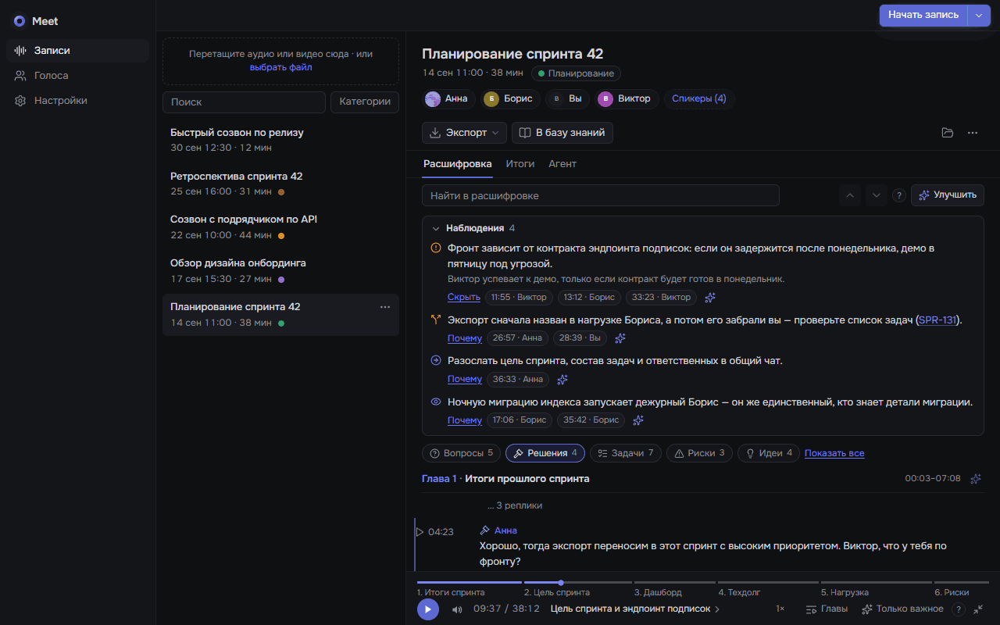
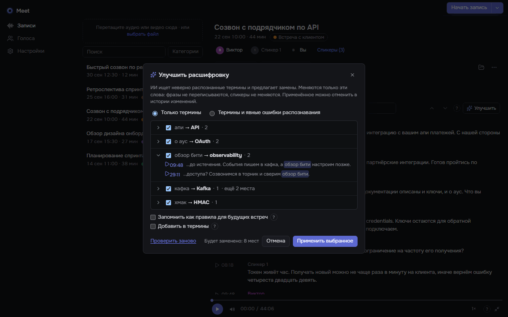
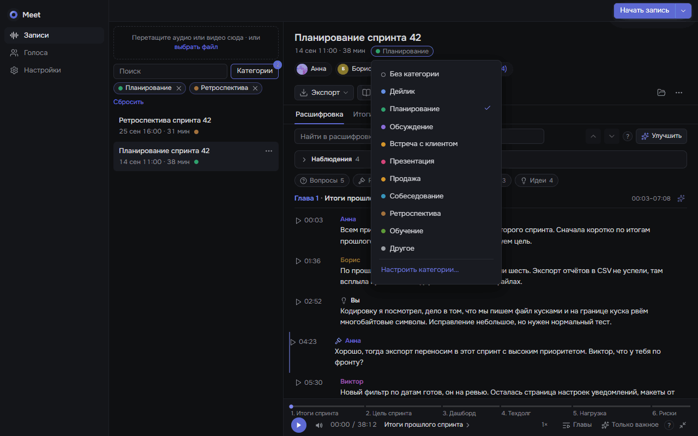
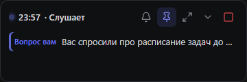
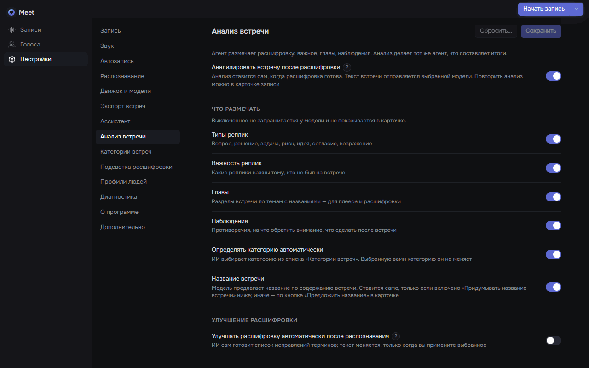
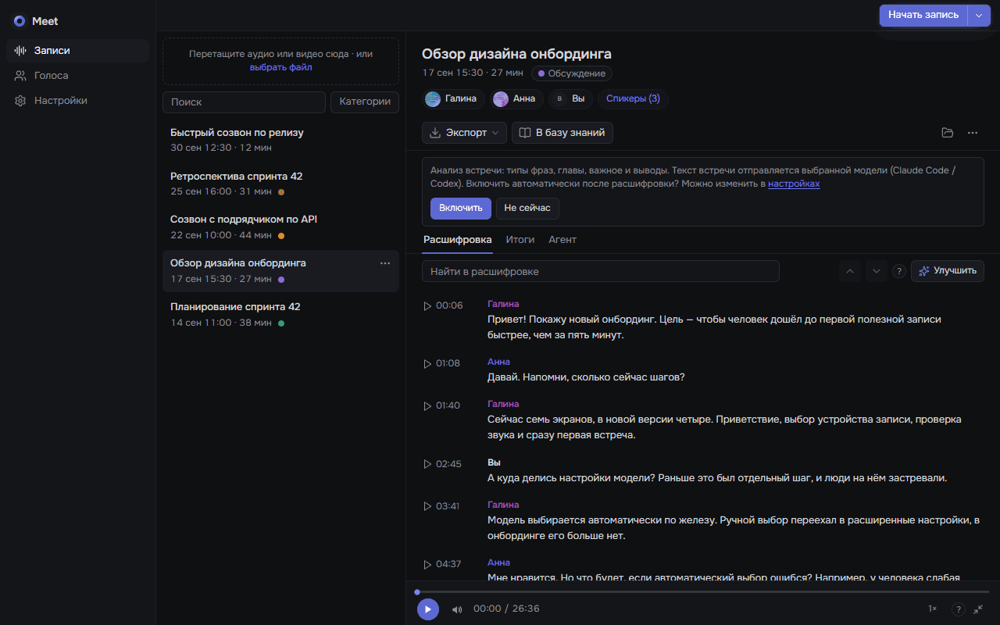

<p align="center">
  
</p>

<p align="center">
  <b>Записывает рабочие встречи и расшифровывает их на вашем компьютере — с именами спикеров, главами, итогами и живым ассистентом.</b>
</p>

<p align="center">
  <a href="LICENSE"></a>
  <a href="https://github.com/rnv812/meet-transcriber/releases"></a>
  
  <a href="https://tauri.app"></a>
</p>

<p align="center">
  <a href="#что-это">Что это</a> ·
  <a href="#возможности">Возможности</a> ·
  <a href="#установка">Установка</a> ·
  <a href="#как-пользоваться">Как пользоваться</a> ·
  <a href="#без-приложения-cli">CLI</a> ·
  <a href="#приватность">Приватность</a> ·
  <a href="#разработка">Разработка</a> ·
  <a href="#english-summary">English</a>
</p>

## Что это

Meet — приложение для Windows, которое записывает созвоны и расшифровывает их
локально: распознаёт речь, разделяет её по спикерам и узнаёт знакомые голоса.
Оно живёт в трее, само начинает запись, когда начинается звонок, и работает на
видеокарте NVIDIA или на процессоре (на процессоре по умолчанию — быстрая
модель GigaAM для русской речи). Анализ встречи, итоги, живой ассистент и агент
по встрече работают через вашу подписку Claude Code или Codex, через OpenCode
либо через локальную модель. Записи, расшифровки и база голосов хранятся на компьютере;
что и когда отправляется модели, описано в разделе
[«Приватность»](#приватность).

## Возможности

**Запись**
- Две дорожки: ваш микрофон и звук собеседников (WASAPI loopback) — без
  виртуальных кабелей и ботов в звонке.
- Автозапись звонков в Zoom, Teams, Телемосте, Dion, Webex, мессенджерах и в
  браузере; обрыв связи и перезаход не делят встречу на части.
- Запуск из трея или окна; импорт готовых аудио- и видеофайлов перетаскиванием.

**Расшифровка**
- На процессоре по умолчанию — GigaAM: открытая модель для русской речи с
  пунктуацией, распознаёт примерно в 10 раз быстрее Whisper medium. На
  видеокарте — Whisper large-v3, дообученная на русском. Для других языков и
  по вашему выбору — Whisper.
- Текст виден сразу после распознавания, подписи спикеров появляются следом.
- Разделение на спикеров (pyannote) и база голосов: назовите человека один
  раз — дальше он узнаётся сам.
- Спикеры и на вашем микрофоне: по образцу вашего голоса Meet отличает вас от
  людей рядом («в комнате») и убирает повторы соседа по звонку и эхо колонок.
- Панель «Спикеры»: подсказки по голосу, отмена и история правок, исправление
  отдельных реплик, «Разделить спикера» по голосу и «Переразделить на
  спикеров» — без повторного распознавания речи.
- «Исправить…» — правка неверно распознанного слова во всей встрече и в
  будущих расшифровках; «Улучшить расшифровку» — модель находит термины,
  записанные кириллицей («апи» → «API»), а вы отмечаете, что заменить.
- Термины распознавания подсказывают имена, продукты и жаргон.
- Движок и модели можно держать на другом диске (экспериментально).

**Встречи**
- Анализ встречи: типы реплик (вопрос, решение, задача, риск, идея…), важные
  реплики, главы с названиями и наблюдения.
- Плеер с главами, как на YouTube: кривая важности, режим «Только важное»,
  горячие клавиши; щелчок по реплике — переход к этому месту.
- Категории встреч (дейлик, планирование, встреча с клиентом…) с фильтром в
  списке; название встречи от ИИ — по желанию.
- Поиск по названиям и тексту всех встреч, подсветка совпадений.
- Задачи Jira — ссылками, даже когда их назвали голосом: «ORION 2122»,
  «орион двадцать один двадцать два», «в баге 4452».
- Объединение записей одной встречи, правка имён, экспорт в Markdown, TXT и SRT.

**Ассистент**
- Итоги: решения, задачи «кто · что · срок», открытые вопросы, цитаты с таймкодами.
- Вкладка «Агент» — Claude Code, Codex или OpenCode в терминале прямо в папке встречи;
  «Спросить агента» у любой реплики, пункта итогов или главы. Сессия агента
  продолжает работать, пока вы переходите к другим вкладкам и встречам.
- Живой ассистент — участник встречи: слушает разговор и сам коротко пишет
  вам в чат, с кнопками ответа под ситуацию; вы пишете ему, вставляете
  скриншоты и файлы, ставите 👍 / 👎 / ❓. Знает карту вашей базы знаний и
  прошлых встреч группы; открывать документы ему велено только по вашей
  просьбе или с согласия. После встречи разговор можно продолжить в карточке. Его можно включить и посреди обычной записи —
  без её остановки, а если он не запустился, запись идёт дальше.

**Интеграции**
- Выгрузка в базу знаний (например, Obsidian): папка на встречу по шаблону,
  расшифровка, итоги, по желанию субтитры и аудио.
- Командная строка `meet` и локальный API — для скриптов и агентов.

<table>
  <tr>
    <td width="50%"></td>
    <td width="50%"></td>
  </tr>
  <tr>
    <td align="center">Расшифровка с главами и плеер с кривой важности</td>
    <td align="center">Наблюдения и фильтр по типам реплик</td>
  </tr>
  <tr>
    <td></td>
    <td></td>
  </tr>
  <tr>
    <td align="center">Итоги: решения и задачи</td>
    <td align="center">Агент в папке встречи</td>
  </tr>
  <tr>
    <td></td>
    <td></td>
  </tr>
  <tr>
    <td align="center">Улучшить расшифровку: «апи» → «API»</td>
    <td align="center">Категории встреч и фильтр списка</td>
  </tr>
  <tr>
    <td colspan="2" align="center"><br><br></td>
  </tr>
  <tr>
    <td colspan="2" align="center">Живой ассистент: «Вам вопрос», подсказки, ответ по ходу; свёрнутая панель</td>
  </tr>
  <tr>
    <td></td>
    <td></td>
  </tr>
  <tr>
    <td align="center">Настройки анализа встречи</td>
    <td align="center">После обновления с 0.2.x: включить анализ?</td>
  </tr>
</table>

<sub>На скриншотах — выдуманные встречи и люди.</sub>

## Установка

Нужна Windows 10 или 11 (x64). Права администратора не требуются.

1. Скачайте `meet_<версия>_x64-setup.exe` со страницы
   [Releases](https://github.com/rnv812/meet-transcriber/releases). Рядом
   лежит `SHA256SUMS.txt`; сверить файл можно командой
   `certutil -hashfile meet_<версия>_x64-setup.exe SHA256`.
2. Установщик не подписан, поэтому SmartScreen его остановит: «Система Windows
   защитила ваш компьютер» → **Подробнее** → **Выполнить в любом случае**.
3. Программа ставится в `%LOCALAPPDATA%\meet`, ярлык появляется в меню «Пуск»
   и на рабочем столе.


**Мастер первого запуска** проведёт через несколько шагов:

- определит видеокарту и выберет движок: для NVIDIA (CUDA) — около 4,5 ГБ
  загрузки и 8 ГБ на диске, для процессора — около 0,6 ГБ и 3 ГБ;
- поставит движок расшифровки (Python, PyTorch, библиотеки распознавания) —
  ход виден по шагам;
- поможет подключить токен Hugging Face (шаг можно пропустить);
- скачает модели — ещё до 4,5 ГБ;
- проверит микрофон и звук собеседников;
- предложит записать образец вашего голоса — около 25 секунд чтения вслух
  (шаг можно пропустить);
- предложит запускаться вместе с Windows.

Дальше приложение живёт в трее. Мастер можно запустить снова: «Настройки →
Движок и модели».

<br clear="right">

### Токен Hugging Face

Токен нужен только для разделения на спикеров и образца вашего голоса: модель
[pyannote/speaker-diarization-community-1](https://huggingface.co/pyannote/speaker-diarization-community-1)
скачивается после принятия её условий. Без токена расшифровка работает, но
реплики делятся только на «Вы» и «Собеседник». Скачанные модели потом
грузятся с диска, без обращения к сети.

1. Войдите на [huggingface.co](https://huggingface.co) (регистрация бесплатная).
2. Откройте [страницу модели](https://huggingface.co/pyannote/speaker-diarization-community-1)
   и примите условия использования.
3. Создайте токен с правом чтения (Read) в
   [настройках токенов](https://huggingface.co/settings/tokens).
4. Вставьте его в мастер или в «Настройки → Движок и модели». Приложение
   проверит доступ и сохранит токен в диспетчере учётных данных Windows.

### Обновление

- Скачайте новый установщик и запустите его поверх — записи, голоса и
  настройки сохранятся.
- Или нажмите «Настройки → О программе → **Проверить обновления**»: приложение
  сверит версию с последним выпуском, скачает установщик, проверит его SHA-256 и
  запустит. Во время записи обновиться нельзя — сначала остановите её.

После обновления движок новой версии ставится в фоне тем же профилем (CUDA или
CPU); пакеты почти все берутся из кэша, обычно это минута-две.

**Что меняется при обновлении с 0.2.x:**

- Если на процессоре стояла модель по умолчанию (Whisper medium), распознавание
  переходит на GigaAM; другая выбранная вами модель Whisper остаётся. Модель
  GigaAM (около 0,45 ГБ) скачивается при первой расшифровке.
- Автоматический анализ встречи у обновившихся пользователей сначала
  выключен. Когда модель подключена, Meet один раз предложит включить его в
  карточке встречи и предупредит, что текст встречи отправляется выбранной
  модели. «Включить» сразу проанализирует и открытую встречу. Ответ
  запоминается; изменить его можно в «Настройки → Анализ встречи».
- Названия встреч от ИИ и автоматическое улучшение расшифровки выключены,
  пока вы их не включите.

### Где хранить движок и модели (экспериментально)

Движок (для NVIDIA около 7 ГБ) и модели можно перенести на другой диск:
«Настройки → Движок и модели → **Где хранить движок и модели**». Окно
покажет, сколько нужно места. Затем движок ставится в новую папку заново,
модели Meet копируются с проверкой, а прежняя копия удаляется, только когда
служба записи заработала из новой папки. Перенос ждёт конца записи и
расшифровки. Прерванный перенос можно продолжить. Папки в OneDrive и iCloud,
сетевые диски и FAT32 не подходят. Модели Meet в общем кэше Hugging Face
Meet предложит удалить, чужие модели он не трогает. Записи не переносятся: у
них своя папка. Если папка недоступна (внешний диск отключён), окно предложит
«Повторить» или «Вернуть на системный диск». На настоящей установке перенос
ещё не опробован.

### Удаление

«Параметры → Приложения → Meet → Удалить» убирает программу, ярлыки и
автозапуск. Данные остаются в `%LOCALAPPDATA%\meet` — записи, база голосов,
настройки, журналы, модели GigaAM и движок (или в папке, выбранной для
движка и моделей), — и повторная установка подхватит их. Чтобы убрать всё,
удалите эту папку, при желании — кэши
`%USERPROFILE%\.cache\huggingface` и `%LOCALAPPDATA%\uv\cache` (они общие с
другими программами) и запись `meet` в диспетчере учётных данных Windows.

### macOS (экспериментально)

> Сборка для macOS 13 и новее на Apple Silicon (M1 и новее) **не проверена на
> реальном Mac**: она собирается и проходит тесты в CI, но запись, расшифровку
> и разрешения на живой машине ещё никто не пробовал. Если что-то не так —
> пришлите журнал (`~/Library/Application Support/meet/logs`).

1. Скачайте `Meet_<версия>_aarch64.dmg` со страницы
   [Releases](https://github.com/rnv812/meet-transcriber/releases); сумма —
   в том же `SHA256SUMS.txt` (`shasum -a 256 Meet_<версия>_aarch64.dmg`).
2. Откройте образ и перетащите Meet в «Программы».
3. Приложение не подписано сертификатом Apple, поэтому при первом запуске
   macOS его остановит. Откройте «Системные настройки → Конфиденциальность и
   безопасность» и нажмите **«Всё равно открыть»** рядом с сообщением о Meet.
   Или в Терминале: `xattr -dr com.apple.quarantine /Applications/Meet.app`.
4. Разрешения, которые macOS спросит от имени Meet:
   - **Микрофон** — ваш голос;
   - **Запись экрана** (в macOS 15 — «Запись экрана и системного звука») —
     голоса собеседников: системный звук пишется через ScreenCaptureKit,
     изображение экрана не сохраняется. Без разрешения записывается только
     микрофон: окно покажет «Звук собеседников не записывается» с кнопкой
     «Открыть настройки», а карточка встречи — что голосов собеседников в
     записи нет. Разрешение, данное посреди встречи, действует со следующей
     записи. Если после этого macOS предложит «Завершить и открыть снова»,
     во время встречи выберите **«Позже»**, чтобы не прервать запись.
5. Запасной путь для звука собеседников — виртуальное устройство
   [BlackHole](https://github.com/ExistentialAudio/BlackHole): направьте в него
   звук звонка («Настройка Audio-MIDI» → «Устройство с несколькими выходами») и
   выберите BlackHole в «Настройки → Звук → Звук собеседников».

Отличия от Windows: данные — в `~/Library/Application Support/meet`, токен
Hugging Face — в связке ключей macOS, значок — в строке меню: левый щелчок
открывает панель записи (идёт ли запись, «Остановить», «Начать запись»,
«Открыть запись»), правый — меню, щелчок по значку в Dock — окно. Claude Code
и Codex находятся и при запуске из Finder или Dock. Движок —
профиль «Apple Silicon» (около 0,6 ГБ загрузки и 3 ГБ на диске): распознавание
на процессоре (GigaAM, Whisper int8), разделение на спикеров — на графике
(MPS), если оно её поддерживает. Автозапись видит звонок по микрофону и звуку
программы (macOS 14 и новее); сайт звонка в браузере не определяется. Панель
ассистента — без прозрачных углов. Обновление по кнопке («Настройки → О
программе») заменяет Meet в «Программах» на месте и перезапускает его; без прав
администратора macOS один раз спросит пароль администратора. Meet, запущенный
из «Загрузок» или прямо из образа, предложит переместиться в «Программы».
Шаги обновления — в `~/Library/Application Support/meet/logs/update.log`
(«Открыть папку журналов» в «О программе»).

## Как пользоваться

### Трей и запись

Значок в трее показывает состояние: ожидание звонка, запись (в подсказке —
сколько она идёт), расшифровка. **Левый щелчок** открывает окно, **правый** —
меню: «Начать запись», «Начать запись с ассистентом», «Импортировать файл…»,
переключатель «Автозапись», «Выход». Во время записи «Остановить и сохранить»
стоит наверху, а «Отменить запись…» — внизу и сначала спрашивает
подтверждение. На macOS левый щелчок по значку в строке меню открывает панель
записи, а это меню — правый.

Запись идёт двумя дорожками и после остановки сразу расшифровывается
(отключается в «Настройки → Запись»). Микрофон и устройство вывода по умолчанию
берутся из Windows, выбрать другие можно в «Настройки → Звук».

### Автозапись

«Настройки → Автозапись» — отметьте программы, в которых созваниваетесь:

- **Приложения** (Zoom, Microsoft Teams, Яндекс Телемост, Dion, Webex,
  Telegram, Discord и другие): запись начинается, когда программа заняла
  микрофон или воспроизводит звук.
- **Браузеры** (Chrome, Edge, Firefox, Яндекс Браузер и другие): звонком
  считается микрофон, занятый дольше 15 секунд, — видео и голосовой поиск
  запись не запускают. Можно дополнительно требовать сайт звонка в заголовке
  окна (Google Meet, Телемост, Jitsi…).

После звонка запись ждёт возвращения 10 минут (от 1 до 60): обрыв связи и
перезаход не делят встречу на две. Минуты ожидания потом обрезаются — в записи
остаётся 30 секунд после конца звонка.

### Живой ассистент

«Начать запись ▾ → **С ассистентом**» в окне или «Начать запись с
ассистентом» в трее. Это обычная запись, к которой подключается ассистент:
звук пишется сразу, а ход старта («загружаю модель распознавания…») виден в
окне. Если ассистент не запустился или упал, запись идёт дальше, а причина
видна в окне. Поверх всех окон появится панель; фокус у звонка она не
забирает. Если запись уже идёт без ассистента, включите его через «Стоп ▾ →
**Включить ассистента**» в окне или тот же пункт в трее: запись не
прерывается, а ассистент сначала догоняет уже сказанное (в шапке панели —
«Догоняю N %») и дальше работает вживую. «Выключить ассистента» отключает
только его — запись продолжается.

Ассистент — участник встречи. Он слушает разговор вместе с вами и сам пишет
вам в чат: коротко, от первого лица, когда видит пользу — вопрос, который
стоит задать, риск, неточность, расхождение с документом, следующий шаг.
«Я посмотрел план — там срок 15.11, а не 01.12». Сказать нечего — молчит.
Отвечать ему не обязательно: обычно чат просто читают краем глаза.

- **Чат.** Сообщения ассистента и ваши — в одной ленте. Писать ему можно в
  любой момент: Enter — отправить, Shift+Enter — новая строка. Над пустым
  полем есть быстрые вопросы «Что я пропустил?», «Что ответить?», «Кратко
  итоги». Ваше сообщение ассистент получает сразу, даже если как раз
  разбирает разговор, и отвечает на него первым. «Стоп» обрывает ответ,
  который пишется. Расшифровка идёт узкой полосой сбоку (в узкой панели — сверху),
  её ширину можно тянуть разделителем хоть на полэкрана (чату остаётся не
  меньше 280 px), таймкод в сообщении переводит к этому месту. В долгой встрече после
  переподключения лента показывает последние 200 сообщений; «Показать более
  ранние сообщения» дочитывает остальные.
- **Кнопки.** Под сообщением ассистент сам ставит до трёх кнопок под
  ситуацию — «Глянь», «Только сроки», «Не надо». Нажатие — ваш ответ ему
  этими словами.
- **Вопрос вам.** Если на встрече обратились к вам, ассистент пишет суть
  вопроса и короткий ответ, который можно сказать вслух, и закрепляет его
  над лентой.
- **Реакции** у каждого сообщения ассистента: 👍 «Полезно» — такого
  побольше; 👎 «Не по теме» — сообщение мимо (не та тема, неверное
  допущение, не к месту): ассистент поймёт, в чём промахнулся, и
  скорректирует, о чём пишет, — частоту 👎 не меняет, её задаёт только «Как
  часто писать»; ❓ «Поясни» — пояснить это сообщение: на что он опирался и
  что предлагает. Что будет, написано в подсказке у кнопки; при наведении
  рядом с эмодзи видна подпись. После нажатия под сообщением на пару секунд
  появляется «Учту: такое полезно» или «Учту: скорректирую, о чём пишу», а
  после ❓ — «Ассистент поясняет…», пока не придёт ответ. Ответ помечен
  «пояснение», ссылка «к сообщению …» ведёт к поясняемому сообщению.
- **Как часто писать** — «реже», «обычно» или «чаще» (по умолчанию «чаще»):
  в шапке чата и в «Настройки → Ассистент». Меняется на ходу. Сам, без вашего
  вопроса, ассистент пишет не чаще одного нового сообщения в 15 секунд —
  лишнее дописывается к предыдущему. Ответы вам приходят всегда.
- **Шапка** показывает модель, что она видит («разговор, структура базы
  знаний, 2 материала»; если в карте только прошлые встречи группы —
  «карта») и что ассистент делает сейчас: слушает, думает или пишет. «Что я знаю» — сводка встречи, которую ассистент ведёт по ходу.
- **Файлы и скриншоты.** Скриншот — Ctrl+V в поле ввода; файл —
  перетащить на чат или выбрать через «📎». Документы `.md`, `.txt`, `.docx`,
  `.pptx`, `.xlsx`, `.csv`, `.pdf` (до 20 МБ) разбираются на компьютере, модели
  уходит их текст; PDF без текстового слоя (скан) модель видит только по
  названию. Изображения (до 10 МБ) видят только Claude Code и Codex. OpenCode и
  локальная модель изображений не видят: у вложения будет пометка, уходит
  только текст сообщения.
- **Источники.** Если ассистент назвал приложенный файл или документ базы
  знаний — по имени с расширением или по пути в базе, — под сообщением
  появляется чип: щелчок открывает документ в программе по умолчанию. Файл,
  приложенный не из базы знаний и не из папки записей, открывается текстом,
  который из него извлёк Meet. Программы, скрипты, ярлыки и веб-страницы так
  не открываются.
- **Карта.** С начала встречи ассистент знает **карту**: названия папок и
  документов базы знаний (если в «Настройки → Ассистент» задана её папка) и
  список прошлых встреч группы, если встреча в группе, — без содержимого. У
  группы встреч можно указать её папку в базе («Папка базы знаний…» в меню
  группы, там же «Убрать папку базы знаний»; папка видна в заголовке группы)
  — она попадает в карту целиком. Выключатель «Показывать ассистенту
  карту: базу знаний и прошлые встречи группы» убирает и то и другое.
- **Чтение — по просьбе или с согласия.** Ассистенту велено открывать
  документы базы и прошлые встречи, только когда вы попросили («посмотри в
  базе, что решили по SLA») или согласились на его предложение («Похоже, это
  было на встрече 29.09 — глянуть?» → «Глянь»). Это правило в его инструкции,
  а не технический запрет: доступ на чтение к базе и библиотеке встреч у
  ассистента есть с начала встречи (Claude Code, Codex и OpenCode читают
  сами, локальная модель — через Meet), а песочница Codex «только чтение» не
  ограничена этими папками. Файлы, которые вы сами добавили в чат, он читает
  без спроса.
- **Исключения** — папки базы, которых нет в карте (по умолчанию `Личное/`
  и `.trash/`), задаются в «Настройки → Ассистент» — «Не показывать
  ассистенту». Технический запрет на чтение там есть только у Claude Code —
  в настройках его сеанса. У Codex и OpenCode это просьба в инструкции
  (пометка «Исключённые папки — только просьба» в шапке чата и «исключения —
  только просьба» в настройках).
- **Одна сессия на встречу.** Ассистент помнит всю встречу и переписку. Если
  ассистента выключили и включили снова или он перезапустился, Claude Code и
  Codex продолжают тот же свой сеанс (у OpenCode продолжение тоже
  поддерживается); локальная модель получает пересказ переписки.

**После встречи** чат остаётся в карточке на вкладке «**Ассистент**». Там
можно «Продолжить разговор»: попросить письмо по итогам, уточнить, кто что
обещал, спросить про скриншот, присланный на встрече. Приложить новый файл
или скриншот можно так же, как во время встречи (Ctrl+V, перетаскивание,
«📎»); кнопки ассистента и реакции работают и здесь, «Стоп» снимает задачу
ответа. Над пустым полем — «Кратко итоги», «Какие решения приняли?», «Что мне
сделать?». Ответ готовит фоновая
задача (ход виден в карточке) в том же сеансе ассистента; он читает точную
расшифровку и итоги, если они уже есть. Пока встреча расшифровывается,
продолжить разговор нельзя — нужно дождаться расшифровки. Переписка лежит в
папке встречи (`assistant/`), а вкладка «Агент» получает её файлом
`assistant_chat.md`.

«Остановить и сохранить» в панели (или «Стоп» в окне) сохраняет запись сразу,
и она расшифровывается целиком, как обычная. Последнюю сводку ассистент
дописывает в фоне, до полутора минут, и новую запись можно начинать, не
дожидаясь его. Сводка живого режима до готовых итогов видна на вкладке
«Итоги» как черновик.

**Прежний режим.** Ассистент 0.3.5 с подсказками и вкладкой «Спросить»
остаётся запасным вариантом: выключите «Ассистент — участник встречи» в
«Настройки → Ассистент → Живой ассистент». Прежний режим останется ещё на
время как запасной; если без него что-то не получается, напишите нам. В
прежнем режиме вкладки панели такие:

- **Лента** — реплики с именами. Русскую речь живой режим распознаёт GigaAM
  короткими кусками (если модель скачана), реплика появляется примерно через
  4 секунды.
- **Сводка** — тема, главное, решения, задачи «кто — что — срок» и открытые
  вопросы. Пункты обновляются на месте.
- **Подсказки** — «Стоит спросить», «Риск или неясность», «Без ответа»,
  «Термин» (пояснение из вашей базы знаний) и «Следующий шаг». Ассистент
  смотрит на разговор примерно каждые 20 секунд речи («Сдержанно», по
  умолчанию) или каждые 10 («Активно») и сразу — когда на встрече прозвучал
  вопрос или обратились к вам. В тишине модель не вызывается. Если вопрос
  задали вам, наверху появляется карточка «**Вам вопрос**» с черновиком ответа.
- **Спросить** — «Что я пропустил?», «Какие решения уже приняты?», «Что мне
  ответить?» или свой вопрос. Ответ виден по мере генерации.

Свёрнутая панель — одна строка: в новом режиме последнее сообщение
ассистента или закреплённый вопрос вам, в прежнем — самая важная подсказка;
колокольчик в шапке включает режим «Не отвлекать». Если в настройках
осталась «Только сводка» прежнего режима, ассистент — участник встречи вам
не пишет, а сводка ведётся; в «Настройки → Ассистент» об этом предупреждение
с кнопкой «Вернуть чат».

### Анализ встречи

После расшифровки выбранная модель размечает встречу: типы реплик, их
важность, главы с названиями, наблюдения (противоречия, на что обратить
внимание, что сделать после встречи), категорию и, по желанию, название.
Результат лежит в папке записи (`analysis.json`). Что размечать — «Настройки →
Анализ встречи»; там же переключатель «Анализировать встречу после
расшифровки». В новой установке он включён; у тех, кто обновился с 0.2.x, —
выключен, пока они не согласятся на однократное предложение в карточке
встречи. Вручную — «Ещё действия» (⋯) → «Переанализировать» или
`meet analyze`.

- **В расшифровке** — значки типов у реплик, фильтры «Вопросы · Решения ·
  Задачи · Риски · Идеи», полоса у важных реплик, заголовки глав и блок
  «Наблюдения». Что показывать, выбирается в «Настройки → Подсветка
  расшифровки».
- **Ссылки на Jira.** В «Настройки → Подсветка расшифровки → Ссылки на
  Jira» укажите адрес Jira и проекты — ключи вроде `ORION` и `SPR`;
  регулярное выражение не нужно. Ссылкой становится и ключ, написанный
  текстом (`ORION-2122`), и сказанный: «ORION 2122», «орион двадцать один
  двадцать два», «эс пи ар сто два». Русская запись ключа и чтение по
  буквам узнаются сами; если проект называют иначе, добавьте вариант у его
  ключа («орайон»). «Проект по умолчанию» нужен для номеров без проекта
  после слов «баг», «тикет», «задача»: «в баге 4452» → `ORION-4452`. Даты,
  время и суммы («15 марта», «10 утра», «300 тысяч») ссылками не
  становятся. Ссылка показывается значком с ключом поверх сказанных слов,
  над расшифровкой — список «Задачи». Неочевидные упоминания («тот баг про
  экспорт, сорок четыре пятьдесят два») находит анализ встречи, если в
  «Анализ встречи» включено «Ссылки на задачи».
- **Плеер** разбит на главы: подписи под полосой, кривая важности при
  наведении, «Только важное» — проигрываются лишь самые важные фрагменты.
  Клавиши: Пробел или K — пуск и пауза, J и L — 10 секунд назад и вперёд,
  Shift+← и Shift+→ — соседняя глава, M — звук.
- **Категории.** Анализ выбирает категорию из списка (Дейлик, Планирование,
  Встреча с клиентом и другие), если уверен в ней; вручную — щелчок по метке
  под названием встречи. Кнопка «Категории» рядом с поиском фильтрует список
  записей, сам список категорий — в «Настройки → Категории встреч».
- **Название от ИИ** — переключатель «Придумывать название встречи»
  (выключен по умолчанию) или разово «Ещё действия» (⋯) → «Предложить
  название». Названия, которые вы задали сами, не меняются.

### Исправить и улучшить расшифровку

Выделите неверно распознанное слово или фразу и нажмите «**Исправить…**»
(Ctrl+E): исправление можно применить во всей встрече, добавить в термины
распознавания и сохранить правилом для будущих расшифровок (список правил —
«Настройки → Распознавание»).

✦ «**Улучшить**» в строке поиска по расшифровке просит модель найти термины,
записанные кириллицей или похожими словами («апи» → «API», «кафка» →
«Kafka»). Она показывает короткий список замен с флажками; применяется только
отмеченное, одним шагом истории, который можно отменить. Слова меняются,
фразы не переписываются.

### Итоги и агент

У карточки встречи вкладки «Расшифровка · Итоги · Ассистент · Агент»; про
«Ассистент» — в разделе [«Живой ассистент»](#живой-ассистент).

Вкладка «**Итоги**» → «Сделать итоги»: модель пишет резюме, решения, таблицу
задач «Кто · Что · Срок», открытые вопросы и цитаты с таймкодами.

Вкладка «**Агент**» запускает Claude Code, Codex или OpenCode во встроенном терминале в
папке встречи. Перед запуском приложение обновляет `transcript.md`
(расшифровка с именами и таймкодами); рядом лежат `summary.md` и
`analysis.json`, а строка «Контекст» показывает, что получает агент. Кнопка ✦
«**Спросить агента**» у реплики, пункта итогов, главы или подсказки вставляет
в поле ввода ссылку на этот фрагмент — остаётся дописать вопрос. Агента можно
попросить написать письмо по итогам, сверить договорённости с базой знаний
или разобрать спорный момент. «Новая сессия» начинает разговор заново,
«Продолжить прошлую» возвращает к прежнему разговору по этой встрече.
Сессия не обрывается, когда вы уходите на другую вкладку, к другой встрече
или в настройки: агент продолжает работу в фоне, а у встречи с работающим
агентом в списке видна зелёная точка. Одновременно работают до трёх сессий
(включая открытую); если открыть четвёртую, закроется самая давно
простаивающая (занятую работой — никогда), и у неё будет «Продолжить
прошлую». Завершает сессию кнопка «Остановить» или выход из приложения.
Дополнительные параметры запуска и переменные окружения — в «Настройки →
Ассистент → Запуск агента». Что агенту разрешено, определяют его собственные
настройки.

Отдельной вкладки «Вопросы» больше нет: вопросы по встрече задаются агенту.
Прежние вопросы и ответы видны на вкладке «Агент» в свёрнутом списке «Прошлые
вопросы»; команда `meet ask` работает как раньше.

Модель выбирается в «Настройки → Ассистент»: установленный и авторизованный
[Claude Code](https://claude.ai/code) или [Codex](https://github.com/openai/codex)
(работают по вашей подписке) либо локальный OpenAI-совместимый сервер. Там же
задаются модель Claude Code, прокси и папка базы знаний, которую ассистент
может читать.
[OpenCode](https://opencode.ai/docs/) — третий вариант, только явным выбором
(«Авто» его не берёт). Модель задаётся в виде «провайдер/модель», пустое поле
означает модель из настроек OpenCode. Текст уходит провайдеру, выбранному в
OpenCode.

### Спикеры и голоса

**«Спикеры (N)»** в заголовке карточки (или щелчок по имени в шапке)
открывает панель спикеров встречи. У каждого — доля времени, число реплик и
три характерные фразы с ▶; «**Похож на**» — люди из базы голосов с процентом
сходства.

- **Имена.** Щелчок по подсказке, «Назначить…» (человек из базы, новый
  человек, «Это я», «Неизвестный») или «Объединить с…». Правки копятся,
  внизу видно, что изменится, — «Применить» делает их разом. «Запомнить
  голос» кладёт голос в базу: в следующих встречах человек подпишется сам.
- **Отмена.** «Отменить» и «Повторить» (Ctrl+Z, Ctrl+Shift+Z), «История
  изменений» с возвратом к любому шагу. Итоги встречи после правок не
  пересчитываются сами.
- **Отдельные реплики.** Щелчок по имени на реплике — «Только эта реплика»
  или «Эта и следующие подряд»; Ctrl+щелчок и Shift+щелчок выделяют
  несколько. Правый щелчок по тексту — «Разделить реплику здесь»: вторая
  часть уходит другому спикеру (по границе слова).
- **«Разделить…»** — если разделение на спикеров слило двух людей в одного:
  его реплики разводятся по голосу на 2–5 групп автоматически или по образцам
  из базы. Группы можно прослушать и назначить, расшифровка не повторяется.
- **«Переразделить на спикеров…»** в карточке — заново только разделение на
  спикеров: точное число собеседников или диапазон и чувствительность. Текст
  остаётся прежним, имена, данные вручную, сохраняются; результат сначала
  показывается для проверки.
- **Порог узнавания голоса** — общий в «Настройки → Распознавание», для одной
  встречи — в панели: ползунок сразу показывает, какие имена изменятся.

**Спикеры на микрофоне и ваш голос.** Если рядом с вами за одним микрофоном
сидят коллеги, Meet отличает вас от них по образцу вашего голоса. Образец
записывается в мастере или в «Настройки → Звук → **Мой голос**» (около 25
секунд чтения вслух). Его можно найти и по прошлым встречам («Найти по
прошлым встречам», с подтверждением «Да, это я») или запомнить из встречи:
«Это я» с флажком «Запомнить мой голос» в панели спикеров. Люди рядом
получают свои подписи и пометку «в комнате». Повторы соседа, который сидит в
том же звонке, и эхо колонок убираются с микрофона. Что убрано, видно в
панели «Спикеры» в списке «Убрано с микрофона», у каждой фразы есть ▶.
Хранится только отпечаток голоса, запись образца сразу удаляется. Без образца
весь микрофон подписан вами, как раньше.

Раздел «**Голоса**» показывает базу: сколько встреч и минут речи у каждого,
фото или инициалы, переименование, слияние и удаление; новое имя или слияние
переходят во все встречи.

### Поиск

Строка над списком ищет по названиям и тексту всех встреч и показывает
фрагменты с таймкодами. Щелчок по фрагменту открывает встречу на этом месте, а
поиск по расшифровке (Ctrl+F) подсвечивает все совпадения: «2 из 5», стрелки —
к следующему и предыдущему.

### Объединение

Встреча разбилась на несколько записей — отметьте их в списке Ctrl- или
Shift-щелчком и нажмите «**Объединить**». Записи склеиваются по времени и
расшифровываются заново целиком: спикеры общие, на стыках — «— перерыв N мин —».
Исходные записи удаляются, если не отмечено «Сохранить исходные записи».

### Экспорт в базу знаний


«Настройки → Экспорт встреч»: папка для встреч (например, внутри хранилища
Obsidian), шаблон имени папки и что класть внутрь. Подстановки: `{date}`,
`{time}`, `{year}`, `{month}`, `{day}`, `{title}`; «/» создаёт вложенные папки.
С шаблоном `Встречи/{year}/{date} {title}` получится:

```text
C:\Obsidian\Работа\
└── Встречи\
    └── 2026\
        └── 2026-09-14 Планирование спринта 42\
            ├── Транскрипт.md
            └── Итоги.md
```

Выгрузка идёт кнопкой «В базу знаний» в карточке или сама — после расшифровки
и ещё раз, когда готовы итоги. Если у встречи есть анализ, расшифровка
начинается с содержания по главам, а в заголовке файла указана категория.
Файлы, которые вы поправили в базе знаний, не перезаписываются. Разово
сохранить расшифровку файлом — «Экспорт ▾» (Markdown, TXT, SRT).

## Без приложения (CLI)

Основное доступно из командной строки — без окна и без вопросов. У
установленного приложения команда лежит в
`%LOCALAPPDATA%\meet\engine\<версия>\Scripts\meet.exe`, при запуске из
исходников — `.venv\Scripts\meet`. Запись указывается папкой или id (имя папки
в библиотеке, например `2026-09-14_11-00`); `--json` печатает машиночитаемый
ответ. Код выхода: 0 — готово, 1 — ошибка, 2 — неверные аргументы. Если
приложение запущено, исправления, анализ, улучшение и категории идут через
него.

| Команда | Что делает | Пример |
| --- | --- | --- |
| `record` | записать встречу (Ctrl+C — стоп) | `meet record` |
| `transcribe` | расшифровать папку записи или любой аудио/видеофайл | `meet transcribe звонок.mp4 --speakers 3` |
| `import` | добавить файл в библиотеку и расшифровать | `meet import звонок.mp4` |
| `export` | расшифровка в md, txt или srt | `meet export 2026-09-14_11-00 --format srt --out встреча.srt` |
| `fix` | исправить распознанное слово или фразу (`--all`, `--hotword`, `--rule`) | `meet fix 2026-09-14_11-00 "апи" "API" --all` |
| `improve` | модель находит неверно распознанные термины; `--apply` — применить | `meet improve 2026-09-14_11-00 --apply` |
| `analyze` | анализ встречи → `analysis.json` | `meet analyze 2026-09-14_11-00` |
| `title` | предложить название встречи; `--apply` — поставить | `meet title 2026-09-14_11-00 --apply` |
| `category` | показать или поставить категорию; `--clear` — «Без категории» | `meet category 2026-09-14_11-00 "Встреча с клиентом"` |
| `voices` | база голосов: `list`, `rename`, `merge`, `delete`, `avatar` | `meet voices rename "Демьян" "Демьян Петров"` |
| `summary` | итоги встречи → `summary.md` | `meet summary 2026-09-14_11-00 --provider codex` |
| `ask` | вопрос по встрече, ответ → `qa.jsonl` | `meet ask 2026-09-14_11-00 "Кто взял экспорт?"` |
| `kb-export` | выгрузить встречу в базу знаний | `meet kb-export 2026-09-14_11-00` |
| `notes` | то же, что `kb-export` (прежнее имя) | `meet notes 2026-09-14_11-00` |
| `merge` | объединить записи одной встречи и расшифровать | `meet merge 2026-09-14_11-00 2026-09-14_11-40 --keep` |
| `live-stop` | штатно остановить запись с ассистентом | `meet live-stop` |
| `assist` | запись с ассистентом без приложения: чат с ним — на странице в браузере | `meet assist` |
| `status` | что делает служба записи: запись, автозапись, детектор звонка | `meet status` |

Полный список флагов — `meet <команда> --help`.

## Приватность

- **Всегда на компьютере:** запись, распознавание речи (GigaAM и Whisper
  работают локально), разделение на спикеров, база голосов и образец вашего
  голоса, поиск, экспорт. От образца голоса хранится только отпечаток (набор
  чисел), сама запись удаляется сразу после обработки. Данные лежат в
  `%LOCALAPPDATA%\meet` (папку записей, движок и модели можно перенести).
  Служба записи принимает запросы только с этого компьютера: API слушает
  `127.0.0.1` и требует токен.
- **Что получает модель.** Текст встречи (реплики с именами) уходит выбранному
  провайдеру: Claude Code — в Anthropic, Codex — в OpenAI, OpenCode — тому, что
  выбран в нём (сеанс фонового вызова OpenCode после ответа удаляется). С локальным
  OpenAI-совместимым сервером текст не покидает компьютер. Это происходит:
  - **анализ встречи** — сам после расшифровки, импорта и объединения, если
    модель подключена и включено «Анализировать встречу после расшифровки». В
    новой установке переключатель включён; у обновившихся с 0.2.x он выключен,
    пока вы не согласитесь на однократное предложение в карточке встречи.
    Выключается в «Настройки → Анализ встречи»;
  - **итоги, «Улучшить расшифровку», «Предложить название», вопросы `meet
    ask`** — по вашей кнопке или команде. Автоматические названия и
    автоматическое улучшение включаются отдельно и по умолчанию выключены;
  - **живой ассистент** — пока идёт запись с ассистентом и когда вы
    продолжаете с ним разговор после встречи: реплики встречи, ваши сообщения,
    файлы и скриншоты, которые вы добавили в чат (изображения — только Claude
    Code и Codex) и карта — названия папок и документов базы знаний и список
    прошлых встреч группы, без содержимого (выключается в настройках). Доступ
    на чтение к базе и библиотеке встреч у ассистента есть; открывать документы
    и прошлые встречи ему велено только по вашей просьбе или с согласия — это
    правило инструкции, а не запрет. Исключённые папки технически закрыты
    только у Claude Code, у Codex и OpenCode это просьба. Сеанс ассистента
    Claude Code, Codex и OpenCode
    сохраняют в своей истории (в профиле пользователя, отдельно от папки
    встречи) — так ассистент продолжает разговор; при удалении записи он не
    удаляется. В прежнем режиме — реплики для сводки и подсказок, ваши вопросы
    и фрагменты базы знаний;
  - **вкладка «Агент»** — это ваш Claude Code или Codex: он читает файлы папки
    встречи, работает по своим настройкам и хранит сеансы в своей истории.
- **Загрузки.** Модели Whisper, выравнивания и разделения на спикеров — с
  Hugging Face (там же проверяется токен; токен хранится в диспетчере учётных
  данных Windows). Модель GigaAM — с сервера её авторов
  (`cdn.chatwm.opensmodel.sberdevices.ru`) при первой расшифровке на GigaAM.
  Установка движка скачивает Python и пакеты через uv (PyPI,
  download.pytorch.org), пакет GigaAM — закреплённой версией с GitHub.
- **GitHub** — ещё и когда вы нажимаете «Проверить обновления». Сама программа
  за обновлениями в сеть не ходит и телеметрию не собирает.

## Платформы

Windows 10 и 11 (x64). macOS 13 и новее на Apple Silicon — экспериментально,
на реальном Mac не проверено (см. «Установка → macOS»). Linux — в планах.

## Разработка

```text
src/meet/          движок на Python: запись, расшифровка, анализ, библиотека, резидент, control API, CLI
src/meet/assist/   живой ассистент: агент-участник и его чат, сводка; прежние подсказки и вопросы
app/               окно приложения: React + TypeScript (Vite, Vitest)
app/src-tauri/     оболочка на Tauri 2 (Rust): трей, уведомления, движок, обновления, установщик NSIS
mac/audiotap/      помощник записи системного звука для macOS (Swift, ScreenCaptureKit)
tests/             тесты Python
scripts/           сборка выпуска и вспомогательные утилиты
docs/              заметки к выпускам, изображения, планы
```

Понадобятся Python 3.12 и [uv](https://github.com/astral-sh/uv), Node.js 24,
Rust stable (MSVC) и ffmpeg в `PATH` (`winget install Gyan.FFmpeg`).

Запуск из исходников:

```powershell
uv venv --python 3.12
uv pip install torch torchaudio --index-url https://download.pytorch.org/whl/cu128   # без NVIDIA: .../whl/cpu
uv pip install -e ".[engine-cuda,gigaam]" pytest                                     # без NVIDIA: ".[engine-cpu,gigaam]"
cd app
npm install
npm run app        # tauri dev: окно с горячей перезагрузкой; оболочка сама поднимает резидента из .venv
```

При запуске из исходников записи, `voices/`, `hotwords.txt` и `glossary.txt`
лежат в корне репозитория и в git не попадают.

Тесты:

```powershell
$env:PYTHONPATH = "src"; .venv\Scripts\python -m pytest -q                  # Python
cd app; npm run check; npm test                                             # окно
cd app\src-tauri; cargo test; cargo clippy --all-targets -- -D warnings     # оболочка
```

Выпуск: `scripts/build_release.ps1 -Version x.y.z` собирает установщик NSIS
(нужны uv, Node.js и Rust). Тег `v*` запускает ту же сборку в GitHub Actions
(`.github/workflows/release.yml`) и публикует выпуск с описанием из
`docs/release-notes/<тег>.md`.

## Авторы

- **Андрей Алейников** — автор проекта ([@dezlorator1](https://github.com/dezlorator1))
- **Андрей Сивуха** — архитектура десктопного приложения ([@ndrsvh](https://github.com/ndrsvh))
- **Никита Резников** — десктопное приложение и интерфейс ([@rnv812](https://github.com/rnv812))

Сделано с помощью [Claude Code](https://claude.ai/code).

## Благодарности

- [GigaAM](https://github.com/salute-developers/GigaAM) — распознавание русской речи
- [faster-whisper](https://github.com/SYSTRAN/faster-whisper) и
  [CTranslate2](https://github.com/OpenNMT/CTranslate2) — распознавание речи Whisper
- [pyannote.audio](https://github.com/pyannote/pyannote-audio) — разделение на спикеров
- выравнивание по словам в духе [WhisperX](https://github.com/m-bain/whisperX) на
  [wav2vec2](https://huggingface.co/jonatasgrosman/wav2vec2-large-xlsr-53-russian)
- [Tauri](https://tauri.app) и [React](https://react.dev) — приложение
- [uv](https://github.com/astral-sh/uv) — установка движка
- [FFmpeg](https://ffmpeg.org) — работа с аудио и видео

## Лицензия

[Apache-2.0](LICENSE). Авторы и сторонние компоненты — в [NOTICE](NOTICE).
Модели скачиваются с Hugging Face и с сервера авторов GigaAM и
распространяются по своим лицензиям.

## English summary

**Meet** is a Windows 10/11 desktop app that records meetings and transcribes
them locally, with speaker separation and a voice base that recognises people
by voice. It sits in the system tray, starts recording automatically when a
call begins (desktop clients and browser calls), and runs on an NVIDIA GPU
(Whisper large-v3 fine-tuned for Russian) or on the CPU, where GigaAM is the
default for Russian speech (about 10× faster recognition than Whisper medium;
Whisper stays selectable); speakers are separated with pyannote. With a short
sample of your voice it also tells you apart from people sitting next to you
at the same microphone, and drops their duplicates and speaker echo.

Through your own Claude Code or Codex subscription, OpenCode (chosen
explicitly), or a local OpenAI-compatible server, Meet adds meeting analysis (phrase types,
importance, chapters, observations), a chapter-aware player, meeting
categories, summaries, AI fixes for misrecognised terms, a live assistant
that joins the meeting as a participant (it listens, writes short notes in a
chat with suggested replies, takes your messages, screenshots and files, knows
the layout of your knowledge base and is instructed to open documents only when asked; the chat can
be continued after the meeting), and an "Agent" terminal in the meeting
folder.

Audio, transcripts and the voice base stay on your machine. Meeting text is
sent to the chosen model provider (Anthropic for Claude Code, OpenAI for
Codex, the provider configured in OpenCode) when you request a summary, title or AI transcript improvement, while a
live assistant recording runs, when you work in the Agent tab, and automatically after each
transcription for meeting analysis. Automatic analysis is on by default for new installs; users
upgrading from 0.2.x are asked once before it is enabled, and it can be turned
off in Settings. Models are downloaded from Hugging Face and, for GigaAM, from
its authors' server; the app collects no telemetry.

Meetings can be searched, merged and exported to a knowledge base such as
Obsidian. Download the installer from
[Releases](https://github.com/rnv812/meet-transcriber/releases); the
interface is in Russian. An experimental, unsigned build for macOS 13+ on Apple
Silicon (`Meet_<version>_aarch64.dmg`) is published alongside, with a recording
panel under the menu-bar icon; it is built and tested in CI but has not yet been
tried on a real Mac. The engine and models can be moved to another drive
(experimental). Licensed under Apache-2.0.
